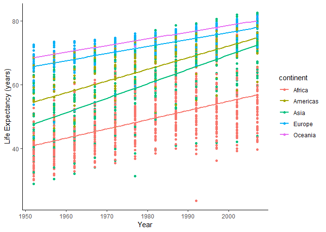
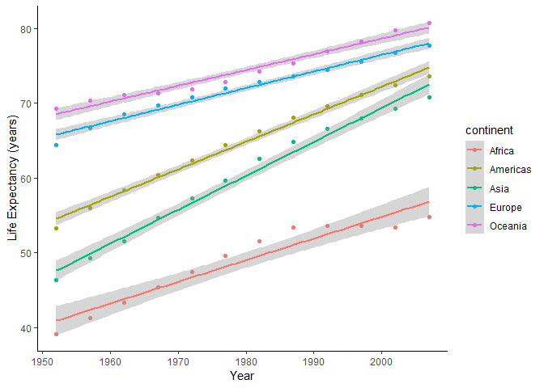
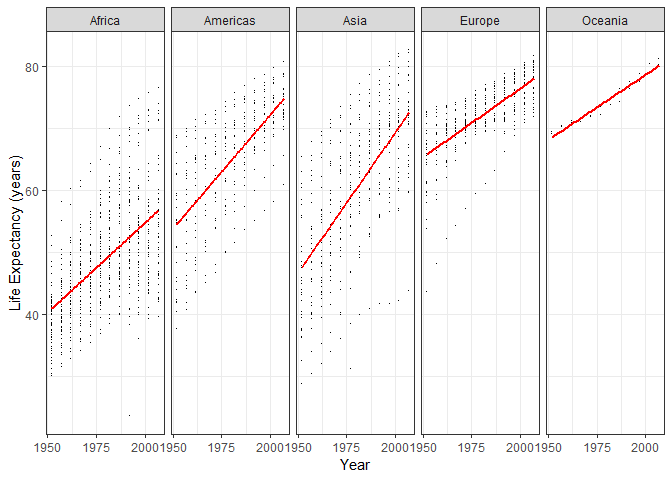
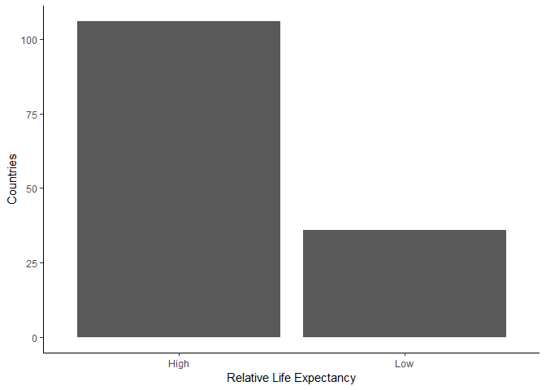
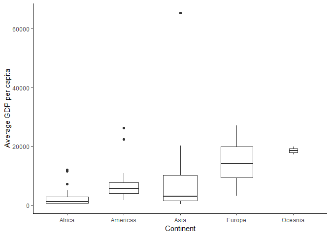

Homework 3: Use dplyr/ggplot2 to manipulate and explore data
================
Jessica Schaub
September 27, 2018

Outline
-------

-   Introduction
-   Loading the Packages
-   Choosing Tasks
-   Task 1: How is life expectancy changing over time on different continents?
-   Task 2: Report the relative abundance of countries with low life expectancy.
-   Task 3: Get the maximum and minimum of GDP per capita within the continents.

### Introduction

This homework has the purpose of creating a "cheatsheet" for functions in `dplyr` and `ggplot` that we can reference in the future. We must select three tasks from a list and tackle them using `dplyr` and `ggplot` where applicable. Please see the [assignment](http://stat545.com/Classroom/assignments/hw03/hw03.html) for more details.

### Loading the Packages

Here, we will load the packages for the assignment.

``` r
# Tidyverse, for ggplot
suppressPackageStartupMessages(library(tidyverse))
# Gapminder, for the data set
suppressPackageStartupMessages(library(gapminder))
# Knitr, for the kable() function
suppressPackageStartupMessages(library(knitr))
```

Notice that `suppressPackageStartupMessages` was used to keep the packages from printing out their messages after loading. This will keep the final .md file clear of unecessary output.

### Choosing Tasks

I have chosen to tackle the following 3 tasks for this assignment:

1.  How is life expectancy changing over time on different continents?

2.  Report the relative abundance of countries with low life expectancy.

3.  Get the maximum and minimum of GDP per capita within the continents.

#### Task 1: How is life expectancy changing over time on different continents?

In this task, we must determine how life expectancy is changing over time for each continent. We can use ggplot to plot life expectancy vs time and color each continent differently to view the trends.

``` r
#Plot of life expectancy vs time for each continent
ggplot(gapminder,aes(year, lifeExp, color=continent)) +
  geom_point() +
  geom_smooth(method="lm", se=FALSE) + #linear trendlines
  ylab("Life Expectancy (years)") +
  xlab("Year") +
  theme_classic() #cleaner look
```



Although some continents increase faster than others, life expectancy does increases with time for every continent.

This plot has a lot of data points. What are some other ways to visualize this question in a cleaner way? We could only include points for the mean life expectancy for each year.

``` r
#Determine mean life expectancy for each year, save as vector life_data for plotting
life_data <- gapminder %>% 
  group_by(continent, year) %>% 
  summarise(mu_le=mean(lifeExp))

#Print out the table with the data
kable(life_data,col.names=c("Continent", "Year", "Mean Life Expectancy"))
```

| Continent |  Year|  Mean Life Expectancy|
|:----------|-----:|---------------------:|
| Africa    |  1952|              39.13550|
| Africa    |  1957|              41.26635|
| Africa    |  1962|              43.31944|
| Africa    |  1967|              45.33454|
| Africa    |  1972|              47.45094|
| Africa    |  1977|              49.58042|
| Africa    |  1982|              51.59287|
| Africa    |  1987|              53.34479|
| Africa    |  1992|              53.62958|
| Africa    |  1997|              53.59827|
| Africa    |  2002|              53.32523|
| Africa    |  2007|              54.80604|
| Americas  |  1952|              53.27984|
| Americas  |  1957|              55.96028|
| Americas  |  1962|              58.39876|
| Americas  |  1967|              60.41092|
| Americas  |  1972|              62.39492|
| Americas  |  1977|              64.39156|
| Americas  |  1982|              66.22884|
| Americas  |  1987|              68.09072|
| Americas  |  1992|              69.56836|
| Americas  |  1997|              71.15048|
| Americas  |  2002|              72.42204|
| Americas  |  2007|              73.60812|
| Asia      |  1952|              46.31439|
| Asia      |  1957|              49.31854|
| Asia      |  1962|              51.56322|
| Asia      |  1967|              54.66364|
| Asia      |  1972|              57.31927|
| Asia      |  1977|              59.61056|
| Asia      |  1982|              62.61794|
| Asia      |  1987|              64.85118|
| Asia      |  1992|              66.53721|
| Asia      |  1997|              68.02052|
| Asia      |  2002|              69.23388|
| Asia      |  2007|              70.72848|
| Europe    |  1952|              64.40850|
| Europe    |  1957|              66.70307|
| Europe    |  1962|              68.53923|
| Europe    |  1967|              69.73760|
| Europe    |  1972|              70.77503|
| Europe    |  1977|              71.93777|
| Europe    |  1982|              72.80640|
| Europe    |  1987|              73.64217|
| Europe    |  1992|              74.44010|
| Europe    |  1997|              75.50517|
| Europe    |  2002|              76.70060|
| Europe    |  2007|              77.64860|
| Oceania   |  1952|              69.25500|
| Oceania   |  1957|              70.29500|
| Oceania   |  1962|              71.08500|
| Oceania   |  1967|              71.31000|
| Oceania   |  1972|              71.91000|
| Oceania   |  1977|              72.85500|
| Oceania   |  1982|              74.29000|
| Oceania   |  1987|              75.32000|
| Oceania   |  1992|              76.94500|
| Oceania   |  1997|              78.19000|
| Oceania   |  2002|              79.74000|
| Oceania   |  2007|              80.71950|

``` r
#Plot life_data to view
ggplot(life_data, aes(year, mu_le, color=continent))+
  geom_point() +
  geom_smooth(method="lm") +
  xlab("Year") +
  ylab("Life Expectancy (years)") +
  theme_classic() #cleaner look
```



This is cleaner than the first plot, but now we don't have a good understanding of the spread of the data. Let's try splitting each continent into it's own graph.

``` r
ggplot(gapminder, aes(year, lifeExp))+
  geom_point(pch='.') + #plot smaller points
  geom_smooth(method="lm", se=FALSE, color='red')+ #linear trendlines
  scale_x_continuous(breaks=c(1950, 1975, 2000)) + #decrease number of ticks, easier to read
  facet_wrap(~continent, nrow=1) + #facet plots into 1 row
  ylab("Life Expectancy (years)") +
  xlab("Year") +
  theme_bw() #cleaner look
```



Now we can see the spread and understand the increasing trend for each continent!

#### Task 2: Report the relative abundance of countries with low life expectancy.

In this task, we will report relative abundance of countries with low life expectancy. We will define "low life expectancy" as an average life expectancy lower than 50. First, let's sort our data according to this new threshold. First, we need to determine the average life expectancy for each country from 1952-2007.

``` r
#add column for relative lifeExp where values less than 50 are labelled "low" and greater than 50 are labelled "high"
#save to variable new_data
new_data <- gapminder %>%
  group_by(country) %>% 
  summarise(mu_lifeExp = mean(lifeExp)) %>% #get average life expectancy for each country
  mutate(rel_lifeExp = if_else(mu_lifeExp < 50, "low", "high")) 
  
#Check that it worked, check the first 10 rows
kable(head(new_data,10), col.names=c("Country", "Avg Life Expectancy", "Relative Life Expectancy"))
```

| Country     |  Avg Life Expectancy| Relative Life Expectancy |
|:------------|--------------------:|:-------------------------|
| Afghanistan |             37.47883| low                      |
| Albania     |             68.43292| high                     |
| Algeria     |             59.03017| high                     |
| Angola      |             37.88350| low                      |
| Argentina   |             69.06042| high                     |
| Australia   |             74.66292| high                     |
| Austria     |             73.10325| high                     |
| Bahrain     |             65.60567| high                     |
| Bangladesh  |             49.83408| low                      |
| Belgium     |             73.64175| high                     |

Now that our data seems ready to go, we can make a box plot of the number of continents with low life expectancies to visualize.

``` r
#Plotting high vs low life expectancy
ggplot(new_data, aes(rel_lifeExp)) +
  geom_bar() +
  scale_x_discrete(labels=c("High", "Low")) +
  xlab("Relative Life Expectancy")+
  ylab("Countries") +
  theme_classic()
```



Then we can determine the exact number of "low" life expectancies.

``` r
#Use the sum function to determine the number of countries with a "low" life expectancy (less than 50)
sum(new_data$rel_lifeExp == "low")
```

    ## [1] 36

It seems there are 36 countries that have an average life expectancy lower than 50, which is suprising! Let's check which countries.

``` r
new_data %>% 
  filter(rel_lifeExp == "low") %>% 
  kable(col.names = c("Country", "Avg Life Expectancy", " Relative Life Expectancy"))
```

| Country                  |  Avg Life Expectancy| Relative Life Expectancy |
|:-------------------------|--------------------:|:------------------------:|
| Afghanistan              |             37.47883|            low           |
| Angola                   |             37.88350|            low           |
| Bangladesh               |             49.83408|            low           |
| Benin                    |             48.77992|            low           |
| Burkina Faso             |             44.69400|            low           |
| Burundi                  |             44.81733|            low           |
| Cambodia                 |             47.90275|            low           |
| Cameroon                 |             48.12850|            low           |
| Central African Republic |             43.86692|            low           |
| Chad                     |             46.77358|            low           |
| Congo, Dem. Rep.         |             44.54375|            low           |
| Cote d'Ivoire            |             48.43617|            low           |
| Djibouti                 |             46.38075|            low           |
| Equatorial Guinea        |             42.96000|            low           |
| Eritrea                  |             45.99925|            low           |
| Ethiopia                 |             44.47575|            low           |
| Gambia                   |             44.40058|            low           |
| Guinea                   |             43.23983|            low           |
| Guinea-Bissau            |             39.21025|            low           |
| Liberia                  |             42.47625|            low           |
| Madagascar               |             47.77058|            low           |
| Malawi                   |             43.35158|            low           |
| Mali                     |             43.41350|            low           |
| Mozambique               |             40.37950|            low           |
| Nepal                    |             48.98633|            low           |
| Niger                    |             44.55867|            low           |
| Nigeria                  |             43.58133|            low           |
| Rwanda                   |             41.48158|            low           |
| Sierra Leone             |             36.76917|            low           |
| Somalia                  |             40.98867|            low           |
| Sudan                    |             48.40050|            low           |
| Swaziland                |             49.00242|            low           |
| Tanzania                 |             47.91233|            low           |
| Uganda                   |             47.61883|            low           |
| Yemen, Rep.              |             46.78042|            low           |
| Zambia                   |             45.99633|            low           |

#### Task 3: Get the maximum and minimum values of GDP per capita within the continents.

In this final task, we need to get the minimum and maximum values for GDP per capita for each contient. Again, we will consider the average GDP per capita.

``` r
#Determine the mean GDP per capita for each country from 1952 to 2007
#Store as variable gdp_data
gdp_data <- gapminder %>% 
  group_by(country, continent) %>% 
  summarise(mu_gdpPercap = mean(gdpPercap))

#View the data, first 10 rows only
kable(head(gdp_data, 10), col.names = c("Country", "Continent", " Avg GDP per Capita"))
```

| Country     | Continent |  Avg GDP per Capita|
|:------------|:----------|-------------------:|
| Afghanistan | Asia      |            802.6746|
| Albania     | Europe    |           3255.3666|
| Algeria     | Africa    |           4426.0260|
| Angola      | Africa    |           3607.1005|
| Argentina   | Americas  |           8955.5538|
| Australia   | Oceania   |          19980.5956|
| Austria     | Europe    |          20411.9163|
| Bahrain     | Asia      |          18077.6639|
| Bangladesh  | Asia      |            817.5588|
| Belgium     | Europe    |          19900.7581|

It might be helpful to view the all of data by continent first.

``` r
#plot average gdp per cap for each continent to look at the data
ggplot(gdp_data, aes(continent, mu_gdpPercap)) +
  geom_boxplot(varwidth = TRUE) + #width of box is realtive to number of observations
  xlab("Continent") +
  ylab("Average GDP per capita") +
  theme_classic()
```



Now we can summarise the data to determine the min and max values for each continent.

``` r
#summarise both min and max GDP for each continent
gdp_data %>% 
  group_by(continent) %>% 
  summarise(min = min(mu_gdpPercap), max = max(mu_gdpPercap)) %>%
  kable(col.names=c("Continent", "Minimum GDP per capita", "Maximum GDP per capita"))
```

| Continent |  Minimum GDP per capita|  Maximum GDP per capita|
|:----------|-----------------------:|-----------------------:|
| Africa    |                471.6630|                12013.58|
| Americas  |               1620.7393|                26261.15|
| Asia      |                439.3333|                65332.91|
| Europe    |               3255.3666|                27074.33|
| Oceania   |              17262.6228|                19980.60|
